# RHEL Ansible Terraform Infrastructure

Modern Infrastructure as Code solution for deploying and configuring RHEL instances on Google Cloud Platform.

## Overview

- **Terraform**: Infrastructure provisioning on GCP
- **Ansible**: Configuration management and application deployment  
- **GitHub Actions**: Automated CI/CD pipeline
- **RHEL 10**: Latest Red Hat Enterprise Linux

## Project Structure

```
rhel-ansible-terraform-infra/
├── terraform/
│   ├── config/
│   │   ├── backend.hcl          # GCS backend configuration
│   │   └── terraform.tfvars     # Variable values
│   ├── main.tf                  # Infrastructure definitions
│   ├── variables.tf             # Variable definitions
│   ├── outputs.tf               # Output definitions
│   ├── provider.tf              # Provider configuration
│   └── Makefile                 # Convenient commands
├── .github/workflows/ci.yml     # CI/CD pipeline
├── playbooks/                   # Ansible playbooks
├── roles/                       # Ansible roles for RHEL configuration
└── inventory/                   # Ansible inventory
```

## Quick Start

### 1. Prerequisites
- Google Cloud Project with billing enabled
- Terraform >= 1.6.0
- Python 3.13+ with Ansible 2.19+

See [PREREQUISITES.md](PREREQUISITES.md) for detailed setup.

### 2. Configuration

Update configuration files:

**terraform/config/backend.hcl:**
```hcl
bucket = "your-project-terraform-state"
prefix = "terraform/state"
```

**terraform/config/terraform.tfvars:**
```hcl
project_id = "your-gcp-project"
region     = "us-central1"
zone       = "us-central1-a"
# ... other variables
```

### 3. Deploy Infrastructure

```bash
cd terraform

# Initialize and deploy
make init
make plan
make apply

# Show outputs
make output
```

### 4. Configure Systems with Ansible

```bash
# Run all configurations
ansible-playbook -i inventory/gcp_compute.yaml playbooks/site.yml

# Run specific roles
ansible-playbook -i inventory/gcp_compute.yaml playbooks/site.yml --tags "chrony,firewalld"
```

## Available Make Commands

```bash
make init          # Initialize Terraform
make plan          # Preview changes
make apply         # Apply changes (with confirmation)
make destroy       # Destroy infrastructure (with confirmation)
make output        # Show outputs
make validate      # Validate configuration
make fmt           # Format files
make clean         # Clean temporary files
make help          # Show all commands
```

## CI/CD Pipeline

The GitHub Actions workflow automatically:
1. Validates Terraform and Ansible code
2. Plans infrastructure changes
3. Deploys infrastructure (on main branch)
4. Deploys Ansible configurations via Cloud Build

## GitHub Secrets Required

- `GCP_PROJECT_ID`: Your Google Cloud Project ID
- `GCP_WORKLOAD_IDENTITY_PROVIDER`: Workload Identity Provider
- `GCP_SERVICE_ACCOUNT_EMAIL`: Service Account email
- `ANSIBLE_BUCKET_NAME`: GCS bucket for Ansible configurations

## Ansible Roles

- **chrony**: Time synchronization
- **firewalld**: Firewall configuration  
- **hostsfile**: /etc/hosts management
- **httpd**: Apache web server
- **ntpd**: NTP server
- **postgresql**: Database server
- **rhel_client**: Base RHEL configuration
- **ssh_hardening**: SSH security

## License

This project is open source and available under the [MIT License](LICENSE).

## 📋 Prerequisites

### Required Tools
- **Python 3.13+** with pip
- **Ansible 2.19+** 
- **Terraform 1.7.5+**
- **Google Cloud SDK (gcloud)**
- **Git**
- **Make** (for convenient commands)

### GCP Requirements
- Active Google Cloud Project with billing enabled
- Service Account with appropriate permissions
- Workload Identity Federation configured
- Required APIs enabled
- Separate GCS buckets for each environment

**📖 See [PREREQUISITES.md](PREREQUISITES.md) for detailed setup instructions**

## 🏗️ Architecture Overview

This project provides:
- **Infrastructure Provisioning**: Terraform manages GCP resources (VMs, networking, storage)
- **Configuration Management**: Ansible handles RHEL system configuration and application deployment
- **CI/CD Pipeline**: GitHub Actions automates testing, validation, and deployment
- **Dynamic Inventory**: GCP Compute plugin for automatic host discovery
- **Security**: Workload Identity Federation for secure authentication

## ✨ Features
* Idempotent tasks: safe to re-run without unintended changes
* Structured roles for reuse and composition
* Separation of variables (defaults vs. environment / host overrides)
* Supports inventory grouping (e.g. `prod`, `stage`, `dev`)
* Extensible pattern for adding compliance or security hardening
* Easy ad‑hoc command examples for quick diagnostics

## ✅ Requirements

### Control Node (Local Development)
* **Python 3.13+** - Latest Python version with enhanced performance
* **Ansible >= 2.19** - Latest Ansible version with enhanced features and security
* **SSH access** to managed RHEL hosts (key-based authentication recommended)
* **Google Cloud SDK** (`gcloud`) for authentication and resource management

### Managed Nodes (Target Servers)
* **RHEL 10** (RHEL 8/9 also supported; other Enterprise Linux derivatives may work with minor adjustments)
* **Python 3** (installed by default on RHEL; bootstrap minimal images if needed)
* **OpenSSH server** enabled and configured

### Optional Development Tools
* **ansible-lint** for code quality and best practices validation
* **terraform** for infrastructure management
* **VS Code** with Ansible and Terraform extensions for enhanced development experience

## 📂 Repository Structure

```
rhel-ansible-terraform-infra/
├── README.md                    # Project overview and usage guide
├── DESIGN.md                    # Detailed architecture and flow documentation
├── PREREQUISITES.md             # Complete setup guide
├── requirements.txt             # Python dependencies
├── requirements.yml             # Ansible collections
├── cloudbuild.yaml              # Google Cloud Build configuration
├── .github/workflows/
│   └── ci.yml                   # GitHub Actions CI/CD pipeline
├── inventory/
│   ├── gcp_compute.yaml         # Dynamic GCP inventory
│   └── hosts                    # Static inventory (fallback)
├── group_vars/
│   └── all.yml                  # Global variables
├── playbooks/
│   └── site.yml                 # Main playbook
├── roles/                       # Ansible roles
│   ├── chrony/                  # Time synchronization
│   ├── firewalld/               # Firewall configuration
│   ├── hostsfile/               # /etc/hosts management
│   ├── httpd/                   # Web server setup
│   ├── ntpd/                    # NTP server configuration
│   ├── postgresql/              # Database server setup
│   ├── rhel_client/             # Base RHEL configuration
│   └── ssh_hardening/           # SSH security hardening
└── terraform/                   # Infrastructure as Code
    ├── config/                  # Configuration files
    │   ├── backend.hcl          # GCS backend configuration
    │   └── terraform.tfvars     # Variable values
    ├── provider.tf              # Provider & version configuration  
    ├── variables.tf             # Variable definitions
    ├── locals.tf                # Local values and configurations
    ├── main.tf                  # Core resources and data sources
    ├── outputs.tf               # Output values and useful commands
    ├── Makefile                 # Convenient commands
    └── startup-controller.sh    # VM bootstrap script
```

## 🚀 Quick Start

### Prerequisites Setup
Before using this project, you must configure Google Cloud Platform and GitHub secrets. Follow the comprehensive guide:

📋 **[Complete Prerequisites Guide](PREREQUISITES.md)**

The prerequisites include:
- GCP project with billing enabled
- Workload Identity Federation setup
- Service account with required permissions
- GitHub repository secrets configuration

### Local Development Setup
1. **Clone the repository**:
   ```bash
   git clone https://github.com/misskecupbung/rhel-ansible-terraform-infra.git
   cd rhel-ansible-terraform-infra
   ```

2. **Install dependencies**:
   ```bash
   # Ensure Python 3.13+ is installed
   # macOS: brew install python@3.13
   # Ubuntu/Debian: sudo apt install python3.13 python3.13-venv python3.13-pip
   # Or use pyenv: pyenv install 3.13.0 && pyenv global 3.13.0
   
   # Create virtual environment (recommended)
   python3.13 -m venv .venv
   source .venv/bin/activate  # On Windows: .venv\Scripts\activate
   
   # Install Python dependencies
   pip install --upgrade pip
   pip install -r requirements.txt
   
   # Install Ansible collections
   ansible-galaxy collection install -r requirements.yml
   
   # Install Terraform
   # macOS: brew install terraform
   # Or download from: https://terraform.io/downloads
   ```

3. **Configure authentication**:
   ```bash
   # Authenticate with Google Cloud
   gcloud auth login
   gcloud auth application-default login
   ```

## ⚡ Technology Stack Benefits

### **Python 3.13 Advantages**
- **Faster execution** with optimized bytecode interpreter  
- **Improved memory efficiency** for better resource utilization
- **Enhanced async/await performance** for concurrent operations
- **Better error messages** for easier debugging and development

### **Ansible 2.19 Features**
- **Enhanced security** with improved credential handling and vault encryption
- **Better performance** for large-scale deployments and complex playbooks  
- **Improved error reporting** and debugging capabilities with detailed stack traces
- **Enhanced collection management** and dependency resolution
- **Advanced templating** features with new filters and functions
- **Better cloud integration** with improved GCP, AWS, and Azure modules
- **RHEL 10 support** with latest system modules and package management

## 🔧 Configuration

### Terraform Configuration Files

The project uses a simplified single-environment structure:

#### Backend Configuration (`terraform/config/backend.hcl`)
```hcl
bucket = "your-terraform-state-bucket"
prefix = "terraform/state"
```

#### Variable Values (`terraform/config/terraform.tfvars`)  
```hcl
project_id              = "your-gcp-project"
machine_type            = "e2-medium"
region                  = "us-central1"
zone                    = "us-central1-a" 
ansible_bucket_name     = "your-ansible-configs"
terraform_state_bucket  = "your-terraform-state"
# ... other configuration values
```

### GitHub Secrets Configuration

#### Required Secrets
- `GCP_PROJECT_ID`: Your Google Cloud Project ID
- `GCP_WORKLOAD_IDENTITY_PROVIDER`: Workload Identity Provider name  
- `GCP_SERVICE_ACCOUNT_EMAIL`: Service Account email
- `ANSIBLE_BUCKET_NAME`: GCS bucket for Ansible configurations

## 🏗️ Infrastructure Deployment

### 1. Deploy Infrastructure with Terraform

```bash
cd terraform

# Initialize Terraform
terraform init

# Plan the deployment
terraform plan -var "project_id=YOUR_GCP_PROJECT" -var "ansible_bucket_name=YOUR_UNIQUE_BUCKET"

# Apply the infrastructure
terraform apply -var "project_id=YOUR_GCP_PROJECT" -var "ansible_bucket_name=YOUR_UNIQUE_BUCKET"
```

### 2. Configure Ansible Inventory

The project uses **dynamic inventory** with the GCP Compute plugin:

```bash
# Test dynamic inventory
ansible-inventory -i inventory/gcp_compute.yaml --list

# Set environment variables (optional)
export ANSIBLE_GCP_PROJECT=your-project-id
export ANSIBLE_GCP_ZONE=us-central1-a
```

### 3. Deploy Configuration with Ansible

```bash
# Run the main playbook
ansible-playbook -i inventory/gcp_compute.yaml playbooks/site.yml

# Check mode (dry-run)
ansible-playbook -i inventory/gcp_compute.yaml playbooks/site.yml --check --diff

# Limit to specific hosts
ansible-playbook -i inventory/gcp_compute.yaml playbooks/site.yml --limit web_servers
```

## � Available Roles

| Role | Purpose | Key Features |
|------|---------|--------------|
| `rhel_client` | Base RHEL configuration | Packages, SELinux, timezone, baseline setup |
| `chrony` | Time synchronization | NTP client configuration (excludes NTP servers) |
| `ntpd` | NTP server | Dedicated time server setup |
| `firewalld` | Firewall management | Service-based rules, common ports |
| `httpd` | Web server | Apache installation, basic configuration |
| `postgresql` | Database server | PostgreSQL installation, initial setup |
| `hostsfile` | Host resolution | Dynamic `/etc/hosts` management |
| `ssh_hardening` | Security hardening | SSH configuration, key-based auth only |

## 🚀 CI/CD Pipeline Flow

The project implements a comprehensive 4-stage deployment pipeline:

### 📋 Stage 1: Repository Validation
**Runs on**: Every PR and push  
**Purpose**: Validate code quality and syntax
- **🔧 Ansible Lint**: Playbook and role best practices validation
- **✅ Terraform Validate**: Configuration syntax verification  
- **📐 Terraform Format**: Code formatting standards check
- **🐍 Python Dependencies**: Requirements and collections validation

### 🗺️ Stage 2: Terraform Plan  
**Runs on**: Every PR and push  
**Purpose**: Preview infrastructure changes
- **🔄 Backend Initialization**: Configure GCS state storage
- **📋 Plan Generation**: Create detailed execution plan
- **💾 Plan Artifact**: Save plan for review and apply stage
- **🔍 Change Analysis**: Compare current vs desired state

### 🚀 Stage 3: Terraform Apply
**Runs on**: `main` branch only (with approval)  
**Purpose**: Deploy infrastructure changes  
**Environment**: Production (requires manual approval)
- **🏗️ Infrastructure Deployment**: Apply Terraform configuration
- **📊 Output Collection**: Gather deployment information
- **💾 State Management**: Update remote state in GCS
- **✅ Validation**: Verify successful deployment

### 📦 Stage 4: Ansible Configuration Deployment
**Runs on**: `main` branch only (after Terraform)  
**Purpose**: Deploy Ansible configurations to trigger Cloud Build
- **📦 Archive Creation**: Package Ansible configurations
- **☁️ GCS Upload**: Deploy configs to trigger bucket
- **🔄 Cloud Build Trigger**: Automatic configuration management
- **📊 Status Reporting**: Deployment summary and next steps

## 🔄 Automated Flow Diagram

```mermaid
graph TD
    A[Code Push/PR] --> B[📋 Validate Repository]
    B --> C[🗺️ Terraform Plan]
    C --> D{Branch Check}
    D -->|PR Branch| E[📊 Plan Review]
    D -->|Main Branch| F[🚀 Terraform Apply]
    F --> G[📦 Deploy Ansible Configs]
    G --> H[☁️ Upload to GCS]
    H --> I[🔄 Cloud Build Triggers]
    I --> J[🤖 Ansible Controller Runs]
    J --> K[✅ Infrastructure Configured]
```



## 🛡️ Security & Approval Gates

### 🔒 Security Features
- **Workload Identity Federation**: No long-lived keys stored
- **Environment Protection**: Production requires manual approval
- **State Encryption**: Remote state stored securely in GCS
- **Audit Trail**: All deployments logged and tracked

### ✋ Approval Gates
1. **Code Review**: All changes require PR review
2. **Validation Gates**: Must pass all lint and validation checks
3. **Production Approval**: Manual approval required for `main` deployments
4. **Rollback Capability**: Previous state versions available for rollback

## 📊 Monitoring & Troubleshooting

### 🔍 Useful Commands
```bash
# Check deployment status
gcloud builds list --limit=5

# View Terraform outputs
cd terraform && terraform output

# Monitor Cloud Build logs
gcloud builds log $(gcloud builds list --limit=1 --format="value(id)")

# SSH to controller for debugging
gcloud compute ssh controller --zone=us-central1-a

# Check Ansible controller logs
gcloud compute ssh controller --command='sudo journalctl -u google-startup-scripts.service -f'

# Manual Ansible run on controller
gcloud compute ssh controller --command='cd /opt/ansible && sudo ansible-playbook -i inventory/gcp_compute.yaml playbooks/site.yml'
```

### 🚨 Troubleshooting Common Issues
- **Plan Failures**: Check GitHub secrets and GCP permissions
- **Apply Failures**: Verify resource quotas and IAM roles
- **Cloud Build Issues**: Check bucket permissions and trigger configuration
- **Ansible Failures**: Review controller startup logs and SSH connectivity

## ⚙️ Configuration Management

### Variables Hierarchy
1. **Role Defaults**: `roles/<role>/defaults/main.yml` (lowest priority)
2. **Group Variables**: `group_vars/all.yml` (global configuration)
3. **Host Variables**: `host_vars/<hostname>.yml` (host-specific overrides)
4. **Extra Variables**: `-e` flag (highest priority)

### Key Configuration Files
- `group_vars/all.yml`: Global settings (timezone, packages, firewall rules)
- `inventory/gcp_compute.yaml`: Dynamic inventory configuration
- `requirements.yml`: Ansible collections dependencies

### Security & Secrets
```bash
# Encrypt sensitive files with Ansible Vault
ansible-vault encrypt group_vars/secrets.yml

# Edit encrypted files
ansible-vault edit group_vars/secrets.yml

# Run playbooks with vault
ansible-playbook -i inventory/gcp_compute.yaml playbooks/site.yml --ask-vault-pass
```

## 🧪 Testing & Quality Assurance

### Local Testing
```bash
# Syntax validation
ansible-playbook -i inventory/gcp_compute.yaml playbooks/site.yml --syntax-check

# Ansible linting
ansible-lint

# Terraform formatting
terraform fmt

# Terraform validation
cd terraform && terraform validate
```

### Continuous Integration
The GitHub Actions pipeline automatically:
- ✅ Validates Ansible syntax and best practices
- ✅ Checks Terraform configuration and formatting
- ✅ Runs security scans on infrastructure code
- ✅ Deploys changes on successful validation

## 🔒 Security Features

### Current Security Implementations
- **SSH Hardening**: Key-based authentication only, disabled root login
- **Firewall Management**: Service-based rules with `firewalld`
- **Workload Identity**: Keyless authentication for CI/CD
- **Network Segmentation**: GCP firewall rules for service isolation
- **Service Account**: Least-privilege IAM permissions

### Security Best Practices
- 🔐 **No SSH Keys in Code**: Uses GCP metadata for key management
- 🛡️ **Minimal IAM Roles**: Service accounts with only required permissions
- 🔒 **Encrypted Secrets**: Ansible Vault for sensitive configuration
- 📊 **Audit Trail**: All changes tracked through Git and CI/CD logs
- 🚫 **No Root Access**: Administrative tasks through sudo only

### Future Security Enhancements
- [ ] CIS RHEL benchmarks compliance
- [ ] Auditd configuration and log monitoring
- [ ] Automatic security updates with `dnf-automatic`
- [ ] SELinux policy customization
- [ ] Intrusion detection system (IDS) integration

## � Extending the Project

### Adding New Roles
```bash
# Create a new role
ansible-galaxy init roles/your_new_role

# Add to the main playbook
vim playbooks/site.yml
```

### Adding New Infrastructure
```bash
# Edit Terraform configuration
vim terraform/main.tf

# Plan and apply changes
cd terraform
terraform plan -var "project_id=YOUR_PROJECT"
terraform apply -var "project_id=YOUR_PROJECT"
```

### Environment-Specific Configurations
```bash
# Create environment-specific variable files
mkdir -p group_vars/production group_vars/staging

# Configure different settings per environment
echo "environment: production" > group_vars/production/main.yml
echo "environment: staging" > group_vars/staging/main.yml
```

## 🤝 Contributing

### Development Workflow
1. **Fork** the repository and create a feature branch
2. **Make changes** following the coding standards
3. **Test locally** using the provided testing commands
4. **Ensure CI passes** - all lints and validations must succeed
5. **Submit a PR** with detailed description of changes

### Coding Standards
- **Ansible**: Follow [Ansible best practices](https://docs.ansible.com/ansible/latest/user_guide/playbooks_best_practices.html)
- **Terraform**: Use consistent naming, add comments, follow [HashiCorp style](https://www.terraform.io/docs/language/syntax/style.html)
- **Git**: Use conventional commit messages
- **Documentation**: Update README.md for significant changes

## 🗺️ Roadmap

### Current Status ✅
- ✅ Infrastructure provisioning with Terraform
- ✅ Configuration management with Ansible
- ✅ CI/CD pipeline with GitHub Actions
- ✅ Dynamic inventory with GCP integration
- ✅ Security hardening and best practices

### Planned Enhancements 🔮
- [ ] **Multi-environment support** (dev/staging/prod)
- [ ] **Molecule testing framework** for role validation
- [ ] **Monitoring & observability** (Prometheus, Grafana)
- [ ] **Backup & disaster recovery** automation
- [ ] **Compliance reporting** (CIS, STIG)
- [ ] **Container orchestration** integration
- [ ] **Advanced networking** (VPN, service mesh)

## 🏗️ Infrastructure Components

This project provisions a complete RHEL infrastructure on Google Cloud Platform:

### Provisioned Resources
- **Ansible Controller VM**: Manages configuration across all hosts
- **Web Server**: RHEL instance with Apache HTTP server
- **Database Server**: RHEL instance with PostgreSQL
- **NTP Server**: Dedicated time synchronization service
- **GCS Bucket**: Stores Ansible configurations and artifacts
- **Networking**: VPC, firewall rules, and service connectivity
- **IAM**: Service accounts with least-privilege permissions

### Automation Flow
1. **Infrastructure Deployment**: Terraform provisions GCP resources
2. **Configuration Sync**: Cloud Build monitors bucket changes
3. **Automatic Configuration**: Ansible controller applies changes
4. **Drift Correction**: Periodic runs ensure consistency
5. **CI/CD Integration**: GitHub Actions manages the entire lifecycle

### Cloud Build Integration
The `cloudbuild.yaml` configuration enables automatic configuration updates:
- **Trigger**: Activated on GCS bucket object changes
- **Sync Process**: Securely copies configurations to controller
- **Execution**: Runs Ansible playbooks across all managed hosts
- **Monitoring**: Provides logs and status of all operations


## 📚 Additional Resources

### Documentation
- 📋 **[Prerequisites Setup Guide](PREREQUISITES.md)** - Complete GCP and GitHub setup
- 🏗️ **[Terraform Configuration](terraform/)** - Infrastructure as Code documentation
- 🔧 **[Ansible Roles](roles/)** - Individual role documentation and variables
- 🚀 **[CI/CD Pipeline](.github/workflows/ci.yml)** - Automation workflow details

### External Resources
- [Google Cloud Workload Identity Federation](https://cloud.google.com/iam/docs/workload-identity-federation)
- [Ansible Best Practices](https://docs.ansible.com/ansible/latest/user_guide/playbooks_best_practices.html)
- [Terraform Google Cloud Provider](https://registry.terraform.io/providers/hashicorp/google/latest/docs)
- [GitHub Actions Documentation](https://docs.github.com/en/actions)

## 🆘 Support & Troubleshooting

### Common Issues
- **Authentication Errors**: Verify Workload Identity Federation setup
- **Terraform Apply Failures**: Check GCP project permissions and quotas
- **Ansible Connection Issues**: Validate SSH keys and firewall rules
- **Dynamic Inventory Problems**: Ensure GCP credentials and project access

### Getting Help
- 🐛 **Bug Reports**: [Open an issue](https://github.com/misskecupbung/rhel-ansible-terraform-infra/issues)
- 💡 **Feature Requests**: Use GitHub Discussions
- 📖 **Documentation**: Check the [Prerequisites Guide](PREREQUISITES.md)
- 🔧 **Configuration**: Review role-specific documentation

## 📄 License

This project is licensed under the MIT License - see the [LICENSE](LICENSE) file for details.

---

**⭐ Star this repository** if you find it helpful! Contributions and feedback are always welcome.

